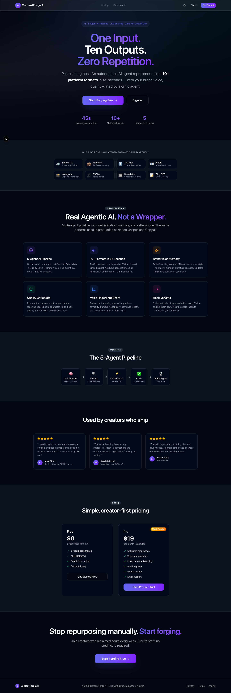
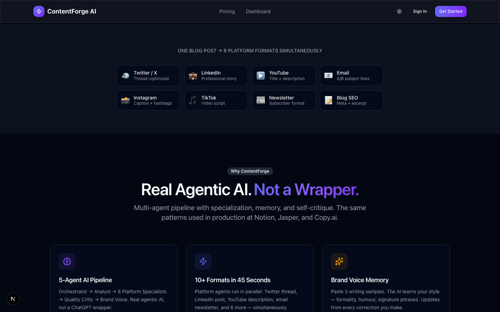
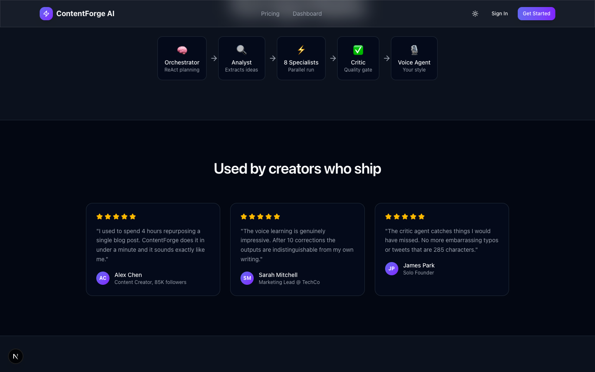
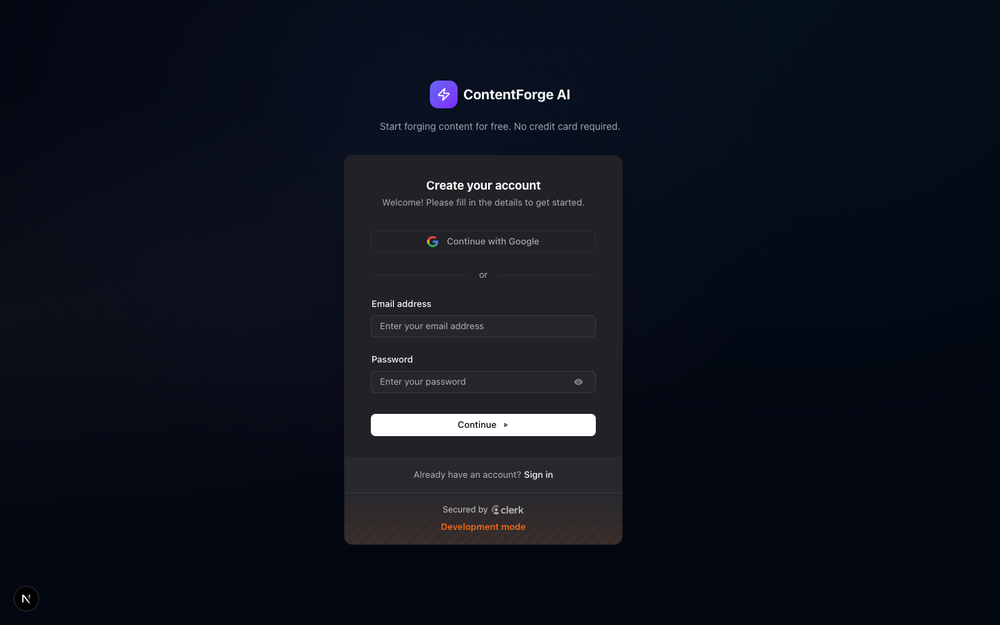
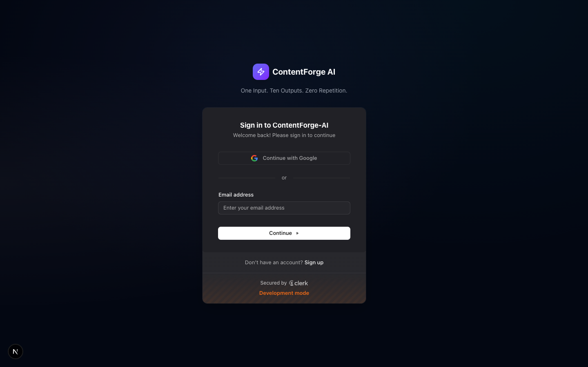

<div align="center">


# ContentForge AI

**One Input. Ten Outputs. Zero Repetition.**

*An AI-powered content repurposing platform that transforms a single piece of content into 8+ platform-native formats in seconds — using a fully custom multi-agent pipeline.*

[](https://nextjs.org)
[](https://react.dev)
[](https://www.typescriptlang.org)
[](https://tailwindcss.com)
[](https://supabase.com)
[](https://groq.com)
[](https://clerk.com)
[](https://stripe.com)

[**Live Demo**](#) · [**Screenshots**](#-screenshots) · [**Architecture**](#-architecture) · [**Quick Start**](#-quick-start)

</div>

---

## 📸 Screenshots

| Landing Page | Features | Pricing |
|:---:|:---:|:---:|
|  |  |  |

| Sign Up | Sign In |
|:---:|:---:|
|  |  |

---

## ✨ What It Does

ContentForge AI solves the biggest pain point for content creators: **content repurposing at scale**. You paste one blog post, essay, or transcript — and a fully autonomous multi-agent AI pipeline instantaneously produces 8 platform-specific, on-brand outputs:

| Platform | What It Generates |
|---|---|
| 🐦 **Twitter / X** | Thread with hooks, engagement variants |
| 💼 **LinkedIn** | Professional long-form post with CTA |
| 📺 **YouTube** | Script, title, description, chapters |
| 📧 **Email** | Newsletter-ready campaign copy |
| 📷 **Instagram** | Caption, hashtag pack, alt text |
| 🎵 **TikTok** | Hook-first short-form script |
| 📰 **Newsletter** | Curated standalone mailer |
| 📝 **Blog** | Full SEO-optimised blog article |

Each output is **graded and self-corrected** by a Critic Agent before it reaches you — no first-draft garbage.

---

## 🧠 Architecture — Multi-Agent AI Pipeline

The core innovation is a **4-stage agentic pipeline** powered by Groq running LLaMA 3.1 70B. Every forge job executes the following stages asynchronously:

```
User Input (text / URL / .docx)
        │
        ▼
┌─────────────────────────────────────┐
│  Stage 1: Orchestrator Agent         │
│  (ReAct pattern — Reasoning + Acting)│
│  • Classifies content type           │
│  • Builds platform execution plan    │
│  • Sets priority order               │
│  • Flags quality/sensitivity issues  │
└────────────────┬────────────────────┘
                 │
                 ▼
┌─────────────────────────────────────┐
│  Stage 2: Analyst Agent              │
│  • Extracts key entities, themes    │
│  • Builds Content Brief             │
│  • Distills audience & tone intent  │
└────────────────┬────────────────────┘
                 │
                 ▼ Promise.allSettled (parallel)
┌──────────────────────────────────────────┐
│  Stage 3: 8× Platform Specialist Agents  │
│  Twitter • LinkedIn • YouTube • Email    │
│  Instagram • TikTok • Newsletter • Blog  │
│  (each receives Content Brief +          │
│   personalised Voice Profile)            │
└──────┬───────────────────────────────────┘
       │  (per platform)
       ▼
┌─────────────────────────────────────┐
│  Stage 4: Critic Agent               │
│  • Scores output 1-10               │
│  • Checks brand alignment           │
│  • Auto-retries if score < 6        │
│  • Returns structured feedback      │
└─────────────────────────────────────┘
        │
        ▼
  forge_results → SSE Stream → UI
```

> **Why this matters:** Most AI tools call a single LLM with a generic prompt and pray for the best. ContentForge separates concerns — planning, analysis, specialised generation, and quality assurance — into distinct agents, mirroring how a real content team would work.

---

## 🎙️ Brand Voice Engine

The **Voice Profile** system is a standout feature. It:

1. **Learns your writing style** from samples you provide — analysing formality, humour, vocabulary tier, sentence rhythm, signature phrases, and CTA preferences.
2. **Injects your voice** into every platform agent at generation time.
3. **Evolves from corrections** — when you edit an AI output, a Voice Learning Agent analyses the delta between original and edited text, and updates your stored profile automatically. The more you use it, the more it sounds like you.

```typescript
// Voice Profile structure
type VoiceProfile = {
  formality_score: number;          // 1 (casual) → 10 (formal)
  humour_level: number;             // 1 (serious) → 10 (playful)
  vocabulary_tier: "everyday" | "professional" | "technical" | "academic";
  tone_adjectives: string[];        // e.g. ["direct", "warm", "confident"]
  signature_phrases: string[];      // recurring openers / transitions
  avoid_words: string[];            // "leverage", "synergy", etc.
  preferred_cta: "question" | "statement" | "link" | "soft-sell";
  opening_style: "personal_story" | "stat" | "question" | "bold_claim";
  corrections_applied: number;      // self-improvement counter
};
```

---

## 🗂️ Project Structure

```
contentforge-ai/
├── app/
│   ├── (auth)/               # Clerk sign-in / sign-up pages
│   ├── (dashboard)/
│   │   ├── dashboard/        # Usage overview & quick start
│   │   ├── forge/            # Main content repurposing UI
│   │   ├── library/          # Saved content library
│   │   ├── analytics/        # Platform & quality stats
│   │   ├── settings/         # Plan, billing, preferences
│   │   └── voice/            # Brand voice training
│   ├── api/
│   │   ├── forge/            # Job creation + SSE stream
│   │   ├── voice/            # Voice profile build & update
│   │   ├── scrape/           # URL → text extraction (Puppeteer)
│   │   ├── usage/            # Token & repurpose tracking
│   │   ├── checkout/         # Stripe checkout session
│   │   └── webhooks/         # Clerk + Stripe event handling
│   └── page.tsx              # Public landing page
│
├── lib/
│   ├── agents/
│   │   ├── orchestrator.ts   # ReAct planning agent
│   │   ├── analyst.ts        # Content extraction & briefing
│   │   ├── critic.ts         # Quality scoring & retry logic
│   │   ├── voice.ts          # Voice build + correction learning
│   │   ├── pipeline.ts       # Job execution coordinator
│   │   └── platforms/        # 8 specialist platform agents
│   ├── schemas/              # Zod schemas for all agent I/O
│   ├── stores/               # Zustand global state
│   ├── hooks/                # Custom React hooks
│   ├── groq.ts               # Groq SDK wrapper & model registry
│   └── supabase.ts           # Typed Supabase client + DB schema
│
├── components/
│   ├── forge/                # Forge UI: pipeline visualiser, result cards
│   ├── landing/              # Marketing landing page sections
│   ├── library/              # Content library grid & filters
│   ├── voice/                # Voice training interface
│   ├── shared/               # Nav, sidebar, layout primitives
│   └── ui/                   # Radix UI component wrappers
│
└── supabase/
    └── migrations/           # SQL schema (versioned)
```

---

## 🛠️ Tech Stack

| Layer | Technology | Why |
|---|---|---|
| **Framework** | Next.js 16 (App Router, Turbopack) | RSC for DB queries, streaming, edge-ready |
| **Language** | TypeScript 5 | Full type safety across client, server, and DB|
| **Styling** | Tailwind CSS v4 (CSS-first config) | Utility-first, zero runtime |
| **Animation** | Framer Motion 12 | Premium micro-interactions & page transitions |
| **State** | Zustand 5 | Lightweight, boilerplate-free global state |
| **Charts** | Recharts 3 | Analytics dashboard visualisations |
| **UI Primitives** | Radix UI | Accessible, unstyled component foundation |
| **Auth** | Clerk | Drop-in auth with webhooks for user sync |
| **Database** | Supabase (PostgreSQL) | Typed client, real-time capable, Row-Level Security |
| **AI / LLM** | Groq — LLaMA 3.1 70B | Blazing fast inference (500K tokens/min free) |
| **Billing** | Stripe | Subscription management + webhook billing events |
| **Validation** | Zod 4 | Runtime schema validation for all agent outputs |
| **Scraping** | Puppeteer + Cheerio | URL-to-text for web content input |
| **Emails** | Resend | Transactional email delivery |
| **Doc Parsing** | Mammoth | `.docx` → plain text for content ingestion |

---

## 🗄️ Database Schema

```
users              → plan, usage limits, Stripe + Clerk IDs
voice_profiles     → per-user JSON voice profile (versioned)
forge_jobs         → job queue with status tracking
forge_results      → per-platform outputs with critic scores
content_library    → saved & tagged content history
voice_corrections  → before/after edits for voice learning
usage_events       → token usage audit log
```

---

## 🤖 Groq Model Registry

| Agent | Model | Rationale |
|---|---|---|
| Orchestrator | `llama-3.1-70b-versatile` | Best planning & reasoning quality |
| Analyst | `llama-3.1-70b-versatile` | Deep content comprehension |
| 8× Platform Agents | `llama-3.1-70b-versatile` | Platform-specific creative quality |
| Critic | `llama3-8b-8192` | Fast, cost-efficient quality gate |
| Voice | `llama-3.1-70b-versatile` | Nuanced style understanding |

---

## 💳 Pricing Model

| | Free | Pro ($19/mo) |
|---|---|---|
| Repurposes / month | 10 | Unlimited |
| Platforms per forge | Up to 3 | All 8 |
| Voice Profile | ✅ | ✅ |
| Content Library | ✅ | ✅ |
| Analytics | ✅ | ✅ |
| Priority generation | ❌ | ✅ |

---

## 🚀 Quick Start

### Prerequisites

- Node.js ≥ 18
- Accounts at: [Clerk](https://clerk.com) · [Supabase](https://supabase.com) · [Groq](https://console.groq.com) · [Stripe](https://stripe.com)

### 1. Clone & Install

```bash
git clone https://github.com/yourusername/contentforge-ai.git
cd contentforge-ai
npm install
```

### 2. Environment Variables

Copy `.env.local.example` and fill in your keys:

```env
# Clerk
NEXT_PUBLIC_CLERK_PUBLISHABLE_KEY=pk_...
CLERK_SECRET_KEY=sk_...
CLERK_WEBHOOK_SECRET=whsec_...

# Supabase
NEXT_PUBLIC_SUPABASE_URL=https://xxx.supabase.co
NEXT_PUBLIC_SUPABASE_ANON_KEY=eyJ...
SUPABASE_SERVICE_ROLE_KEY=eyJ...

# Groq (free at console.groq.com)
GROQ_API_KEY=gsk_...

# Stripe
NEXT_PUBLIC_STRIPE_PUBLISHABLE_KEY=pk_test_...
STRIPE_SECRET_KEY=sk_test_...
STRIPE_PRO_PRICE_ID=price_...
STRIPE_WEBHOOK_SECRET=whsec_...
```

### 3. Database

Run the migration in your Supabase SQL editor:

```bash
# File: supabase/migrations/001_initial.sql
```

### 4. Run Locally

```bash
npm run dev
# → http://localhost:3000
```

### 5. Deploy to Vercel

```bash
npm i -g vercel
vercel
# Add the same env vars in the Vercel dashboard
```

---

## 🔑 Key Engineering Decisions

**1. Parallel agent execution with `Promise.allSettled`**  
Platform agents run concurrently — 8 outputs are generated simultaneously rather than sequentially. `allSettled` ensures a single platform failure doesn't abort the entire job.

**2. Zod-validated agent outputs**  
Every LLM response is parsed through a Zod schema. If the model returns malformed JSON, a safe fallback is applied rather than crashing. This makes the pipeline production-resilient.

**3. Critic auto-retry loop**  
If a platform agent scores below 6/10, the Critic triggers a single regeneration and takes the higher-scored version. Quality gate with zero extra user friction.

**4. Voice Profile as a living document**  
Voice profiles are not static — they update on every user correction via the Voice Learning Agent. The more edits a user makes, the more accurately the AI matches their style.

**5. SSE streaming for real-time feedback**  
Forge jobs are long-running (multi-LLM calls). Results stream to the UI via Server-Sent Events as each platform agent completes, giving users instant feedback rather than a loading spinner.

**6. Typed Supabase client**  
The `Database` type mirrors the full Postgres schema in TypeScript. Every DB call is fully type-checked — no runtime surprises from schema drift.

---

## 📊 Analytics Dashboard

The analytics page surfaces:

- **Total Forges** — successful jobs completed
- **Total Outputs** — individual platform pieces generated
- **Avg Critic Score** — AI self-assessed quality across all outputs
- **Platform Breakdown** — visual bar chart of most-used platforms with per-platform average quality scores

---

## 🧪 What I Learned Building This

- **Agentic orchestration** — Designing stateful pipelines where agents hand off context (Content Brief) to downstream agents required careful schema design and error boundaries at every step.
- **LLM reliability in production** — LLMs occasionally disobey output format instructions. Zod + fallback defaults made the system fault-tolerant without losing the user's work.
- **Voice profile design** — Capturing "writing style" in a structured JSON required iterative experimentation with what dimensions actually affect output quality vs. what's noise.
- **Streaming UX** — SSE-based streaming completely transformed the perceived performance of the app; users see results as they arrive rather than waiting for all 8 to complete.

---

## 📄 License

MIT — feel free to fork, learn from, and build on this.

---

<div align="center">
  Built with ⚡ by <a href="https://github.com/yourusername">Hruday N</a>
  <br/>
  <sub>Next.js · Groq · Supabase · Clerk · Stripe · Framer Motion</sub>
</div>
